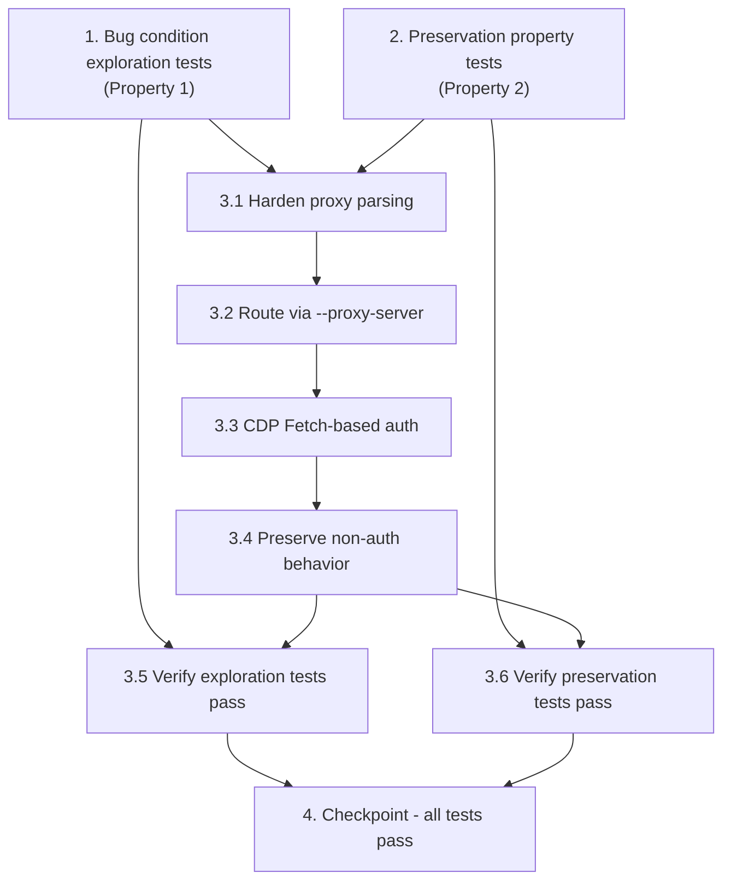

# Implementation Plan

## Overview

This plan fixes authenticated-proxy support in both `main.py` and `autoclose.py`, where valid credentials are never delivered to an authenticating proxy (MV2 `--load-extension` in `main.py`; wrong auth channel plus missing `USER:PASS@IP:PORT` parsing in `autoclose.py`). It follows the exploratory bugfix methodology: first write exploration tests that fail on the unfixed code to prove the bug (Property 1: Bug Condition), then write preservation tests that pass on the unfixed code to lock in existing behavior (Property 2: Preservation), then apply the fix (unified proxy parsing, `--proxy-server` routing, and CDP Fetch-based authentication), and finally re-run both test sets to confirm the bug is resolved with no regressions.

## Tasks

- [x] 1. Write bug condition exploration tests (authenticated proxy auth never delivered)
  - **Property 1: Bug Condition** - Authenticated Proxy Routes With Credentials
  - **CRITICAL**: These tests MUST FAIL on the unfixed code - the failures confirm the bug exists
  - **DO NOT attempt to fix the tests or the code when they fail** - failure here is the goal
  - **NOTE**: These tests encode the expected behavior; they will validate the fix once they pass after implementation
  - **GOAL**: Surface counterexamples that prove the bug and confirm/refute the root-cause analysis (MV2 extension in `main.py`; wrong auth channel + missing `@` parsing in `autoclose.py`)
  - **Scoped PBT Approach**: The bug is deterministic for any authenticated proxy, so scope the property to concrete, reproducible failing cases: `has_auth = true` proxies in both notations pointed at a controlled authenticating proxy
  - **Test setup**: stand up a controlled local proxy that requires Basic auth (e.g. `mitmproxy` / `tinyproxy` / squid with a known user/pass) and a benign target URL; capture the proxy-side access log to confirm whether valid credentials ever reach the proxy
  - Bug condition from design: `isBugCondition(input)` is true when `proxyEnabled = true` AND `parsed.has_auth = true` AND the proxy is live AND credentials are never delivered to the proxy's auth challenge
  - Test assertions should match Property 1 (Expected Behavior): credentials delivered to proxy, page loads without 407/`ERR_*`, tab/window NOT auto-closed
  - Test cases (run each on UNFIXED code):
    - main.py — `IP:PORT:USER:PASS` (e.g. `203.0.113.10:8080:alice:s3cret`): MV2 `--load-extension` is not honored by modern Chrome → auth fails
    - main.py — `USER:PASS@IP:PORT` (e.g. `alice:s3cret@203.0.113.10:8080`): same MV2 failure
    - autoclose.py — `IP:PORT:USER:PASS`: `Proxy-Authorization` via `Network.setExtraHTTPHeaders` does not authenticate the HTTPS `CONNECT` tunnel → auth fails
    - autoclose.py — `USER:PASS@IP:PORT`: `_parse_proxy_string` does not recognize the `@` format → credentials/port dropped → misconfigured proxy
  - Run tests on UNFIXED code
  - **EXPECTED OUTCOME**: Tests FAIL (proxy access log shows no successful auth; Chrome shows 407/`ERR_*` page; tab/window auto-closed) — this is correct and proves the bug exists
  - Document counterexamples found (e.g. "autoclose.py: `alice:s3cret@203.0.113.10:8080` parsed as single host, port empty, credentials lost") to understand root cause
  - Mark task complete when the tests are written, run, and the failures are documented
  - _Requirements: 1.1, 1.2, 1.3, 1.4_

- [x] 2. Write preservation property tests (BEFORE implementing the fix)
  - **Property 2: Preservation** - Non-Authenticated Proxy Behavior Unchanged
  - **IMPORTANT**: Follow the observation-first methodology — observe actual behavior on the UNFIXED code, then encode it as tests
  - Property-based testing is recommended here: it generates many proxy strings and launch configs automatically and catches edge cases (odd ports, empty box, disabled option, dead hosts) that manual tests miss
  - Observe on UNFIXED code and capture the baseline for each non-bug-condition case (`isBugCondition` returns false):
    - Plain proxy `IP:PORT` (no credentials, `has_auth = false`) routes via `--proxy-server` (Req 3.1)
    - Proxy option disabled → no `--proxy-server`, direct connection (Req 3.2)
    - Proxy enabled + empty custom box → auto-fetch fallback (`main.py` `_verify_proxy_country`; `autoclose.py` `_fetch_proxies` + `_test_proxy`) (Req 3.3)
    - Genuinely dead/unreachable proxy → error page detected (`_check_error_page` / `ERR_`/`This site can`/timeout) and tab/window auto-closed (Req 3.4)
    - Rotation/usage limits → `main.py` `IP_USAGE_COUNT`/`MAX_IP_USES` accounting and shuffled unique-host assignment; `autoclose.py` round-robin `self.proxies[(processed-1) % len(self.proxies)]` (Req 3.5)
  - Write property-based tests asserting `launchWithProxy_original(input) == launchWithProxy_fixed(input)` for all non-bug-condition inputs (per Preservation Checking pseudocode in design)
  - Also cover the plain `IP:PORT` edge case from the exploration plan as a baseline that must NOT fail
  - Run tests on UNFIXED code
  - **EXPECTED OUTCOME**: Tests PASS (this confirms the baseline behavior to preserve)
  - Mark task complete when the tests are written, run, and passing on unfixed code
  - _Requirements: 3.1, 3.2, 3.3, 3.4, 3.5_

- [x] 3. Fix authenticated proxy support via CDP Fetch-based authentication

  - [x] 3.1 Harden proxy parsing in both tools (unify the two authenticated formats)
    - `main.py` `_parse_proxy` (~line 360): keep `IP:PORT`, `IP:PORT:USER:PASS`, and add/confirm `USER:PASS@IP:PORT`; split `host:port` from the right so credential separators are tolerated; both authenticated formats yield the same normalized record (`host`, `port`, `user`, `password`, `has_auth = true`)
    - `autoclose.py` `_parse_proxy_string` (~line 211): recognize `USER:PASS@IP:PORT` in addition to `IP:PORT:USER:PASS` and `IP:PORT`, normalizing to the same record shape (`host`, `port`, `user`, `password`, `raw = host:port`)
    - Ensure `has_auth` is true only when BOTH username and password are present; plain `IP:PORT` yields `has_auth = false`
    - _Bug_Condition: isBugCondition(input) where parsed.has_auth = true for either notation_
    - _Expected_Behavior: Property 3 — both notations normalize to the identical proxy configuration_
    - _Preservation: plain `IP:PORT` parsing unchanged (has_auth = false)_
    - _Requirements: 2.1, 2.2_

  - [x] 3.2 Route all proxies through `--proxy-server=http://{host}:{port}` and remove fragile auth paths
    - `main.py` `launch_chrome_subprocess` (~line 472/528): stop selecting `_create_proxy_auth_extension` / `--load-extension` for authenticated proxies; always pass `--proxy-server=http://{host}:{port}` (scheme included) for both authenticated and plain proxies
    - `autoclose.py` `launch_chrome_subprocess` (~line 324) / `_open_single_window` (~line 538/573): remove the `Network.setExtraHTTPHeaders` `Proxy-Authorization` approach; pass `--proxy-server=http://{host}:{port}` using the parsed `host:port` (never the credential-bearing raw string)
    - _Bug_Condition: isBugCondition(input) — credentialed launch path_
    - _Expected_Behavior: Property 1 — Chrome routes through the proxy with credentials; no MV2 extension / destination-only header_
    - _Preservation: plain-proxy `--proxy-server` routing preserved (Req 3.1)_
    - _Requirements: 2.1, 2.2_

  - [x] 3.3 Add CDP Fetch-based proxy authentication and arm it before the credentialed navigation
    - In both tools, after Selenium connects to Chrome: enable `Fetch` interception with `handleAuthRequests = true` (`Fetch.enable`), answer `Fetch.authRequired` with `Fetch.continueWithAuth` using `authChallengeResponse = { response: "ProvideCredentials", username, password }`, and continue `Fetch.requestPaused` with `Fetch.continueRequest`
    - When `has_auth` is true, launch Chrome to a neutral start page (`about:blank`) instead of the target URL, connect Selenium, enable the Fetch auth handler, THEN navigate to the target URL — so auth is armed before the first credentialed challenge
    - Plain-proxy / no-proxy launches keep launching directly to the target URL (no behavior change)
    - main.py flows: connect/navigate in `run` (~line 827) and replacement-window flow (~line 1037); autoclose.py flow: connect/navigate in `run` (~line 807)
    - _Bug_Condition: isBugCondition(input) — proxy 407/CONNECT auth challenge must be satisfied_
    - _Expected_Behavior: Property 1 — credentials delivered to the proxy auth challenge; page loads without 407/connection error; tab not auto-closed_
    - _Preservation: non-authenticated launches navigate directly as today (Req 3.2, 3.3)_
    - _Requirements: 2.1, 2.2, 2.3, 2.4_

  - [x] 3.4 Preserve all non-authenticated behavior
    - Keep the direct-connection path (proxy disabled → no `--proxy-server`), the auto-fetch fallback (empty box), dead-proxy error detection/auto-close, and rotation/usage-limit accounting untouched in both tools
    - _Bug_Condition: NOT isBugCondition(input)_
    - _Expected_Behavior: Property 2 — behavior identical to original for all non-authenticated inputs_
    - _Preservation: Preservation Requirements 3.1–3.5 from design_
    - _Requirements: 3.1, 3.2, 3.3, 3.4, 3.5_

  - [x] 3.5 Verify bug condition exploration tests now pass
    - **Property 1: Expected Behavior** - Authenticated Proxy Routes With Credentials
    - **IMPORTANT**: Re-run the SAME tests from task 1 - do NOT write new tests
    - The tests from task 1 encode the expected behavior; when they pass they confirm credentials are delivered and pages load through the authenticated proxy
    - Run the exploration tests from task 1 against the fixed code (all four authenticated cases in both notations, both tools) using the controlled authenticating proxy
    - Confirm via the proxy access log that valid credentials now reach the proxy, the page loads without 407/`ERR_*`, and the tab/window is NOT auto-closed; reachability matches `curl` through the same proxy
    - **EXPECTED OUTCOME**: Tests PASS (confirms the bug is fixed)
    - _Requirements: 2.1, 2.2, 2.3, 2.4_

  - [x] 3.6 Verify preservation tests still pass
    - **Property 2: Preservation** - Non-Authenticated Proxy Behavior Unchanged
    - **IMPORTANT**: Re-run the SAME tests from task 2 - do NOT write new tests
    - Run the preservation property tests from task 2 against the fixed code
    - **EXPECTED OUTCOME**: Tests PASS (confirms no regressions in plain-proxy routing, direct connection, auto-fetch fallback, dead-proxy detection/auto-close, and rotation/usage limits)
    - Confirm all tests still pass after the fix (no regressions)
    - _Requirements: 3.1, 3.2, 3.3, 3.4, 3.5_

- [x] 4. Checkpoint - Ensure all tests pass
  - Run the full suite: unit tests (parser normalization, command-line builder emits `--proxy-server=http://host:port` with no MV2 path, CDP auth handler responds `ProvideCredentials`), property-based tests (Property 2 / Property 3), and integration tests against the local authenticating proxy (Property 1) in both `main.py` and `autoclose.py`
  - Confirm authenticated proxies work in both notations, plain proxies and direct connection are unchanged, and dead-proxy detection/auto-close still fires
  - Ensure all tests pass; ask the user if questions arise.

## Sandbox Verification Status

The fix (tasks 3.1-3.4) and all pure-Python tests were implemented and run in
the sandbox (Python 3.11.15, pytest + hypothesis): **45 passed, 3 skipped**.

Verified without Chrome (`tools/terabox-automation/tests/`):
- **Property 3 (parsing):** both notations normalize identically in each tool
  and across tools; `has_auth` only when user+password present; plain `IP:PORT`
  unchanged. The original `autoclose.py` `@`-format counterexample
  (`alice:s3cret@... -> port='', creds dropped`) is fixed.
- **Command builder:** authenticated + plain proxies both emit
  `--proxy-server=http://host:port`; no MV2 `--load-extension` path; authenticated
  proxies start at `about:blank`, others go straight to the URL; proxy-disabled
  emits no proxy args.
- **CDP auth handler:** `Fetch.enable{handleAuthRequests:true}`; `authRequired`
  answered with `continueWithAuth`/`ProvideCredentials` carrying the exact
  parsed credentials; `requestPaused` continued; unrelated events ignored.
- **Preservation:** `main.py` per-IP usage accounting (`IP_USAGE_COUNT`/
  `MAX_IP_USES`) and the autoclose round-robin arithmetic.

Requires a live Chrome + controlled authenticating proxy (NOT available in this
sandbox; kept as `@pytest.mark.skip` E2E placeholders in `test_bug_condition.py`):
- Full end-to-end auth in both notations/tools with the proxy access log
  confirming credentials reached the proxy and the page loaded without 407/ERR_.
- Dead-proxy auto-close and auto-fetch fallback end-to-end flows.

## Task Dependency Graph

Tasks 1 and 2 are independent of each other and must both come before the fix (task 3). Within the fix, sub-tasks 3.1 → 3.2 → 3.3 → 3.4 are sequential. Sub-task 3.5 depends on task 1 plus the implemented fix (3.1–3.4), and sub-task 3.6 depends on task 2 plus the implemented fix (3.1–3.4). Task 4 depends on everything.

**Dependency summary:**

- **Task 1** (exploration tests) — independent; must complete before the fix.
- **Task 2** (preservation tests) — independent; must complete before the fix.
- **Task 3.1 → 3.2 → 3.3 → 3.4** — sequential; each depends on the previous. Both task 1 and task 2 precede the fix.
- **Task 3.5** — depends on task 1 (the exploration tests) plus the completed fix (3.1–3.4).
- **Task 3.6** — depends on task 2 (the preservation tests) plus the completed fix (3.1–3.4).
- **Task 4** — depends on all preceding tasks (3.5 and 3.6, and transitively everything else).

## Notes

- **Test-first ordering is mandatory**: Tasks 1 and 2 must be written and run against the UNFIXED code before any fix work begins. Task 1 tests are expected to FAIL (proving the bug); task 2 tests are expected to PASS (capturing baseline behavior to preserve).
- **Do not fix code during task 1**: A failing exploration test is the desired outcome — it confirms the bug and validates the root-cause analysis.
- **Re-run, don't rewrite**: Tasks 3.5 and 3.6 re-run the exact tests from tasks 1 and 2 respectively — do not author new tests for verification.
- **Controlled authenticating proxy required**: Exploration and verification rely on a local proxy that requires Basic auth (e.g. mitmproxy, tinyproxy, or squid) with access logging to confirm whether credentials actually reach the proxy.
- **Both tools, both notations**: Every fix and test must cover `main.py` and `autoclose.py` across both authenticated formats (`IP:PORT:USER:PASS` and `USER:PASS@IP:PORT`).
- **Property labels enable hover status**: The `**Property 1**` and `**Property 2**` annotations are intentional and drive property-based-test status tracking; preserve them.
