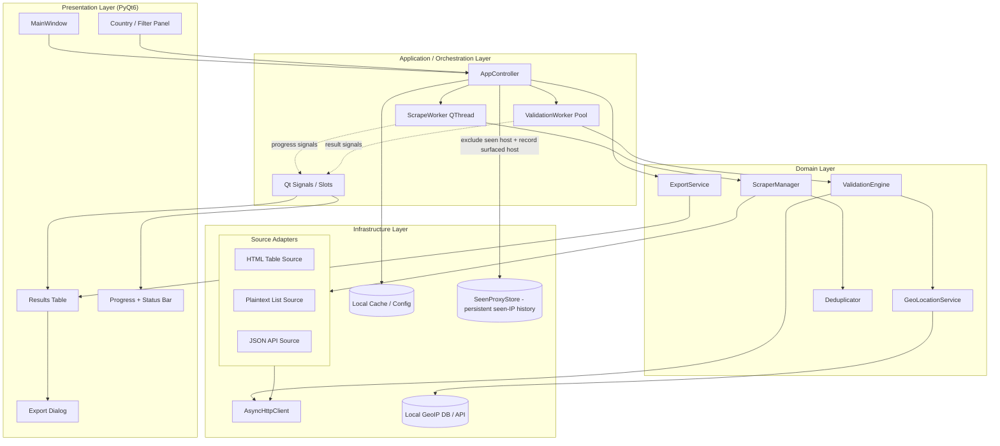
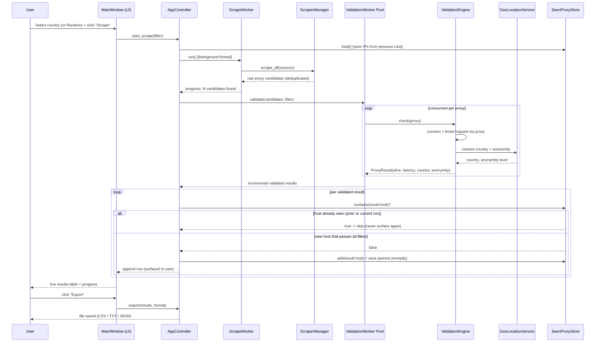

# Design Document: Proxy Scraper GUI

## Overview

Proxy Scraper GUI is a standalone, cross-platform **Python desktop application** that harvests free proxy servers from many public sources across the internet, validates each proxy for reachability, speed, and anonymity, and presents only the working, high-quality ("premium") results to the user. The user can filter proxies by a specific country or request results from any/random country, then export the validated list to disk.

The application uses **PyQt6** for the user interface and an asynchronous/threaded worker layer for scraping and validation so the UI stays responsive while hundreds or thousands of proxies are checked concurrently. "Premium" is not a paid tier — it is a quality guarantee produced by the pipeline: a proxy is only shown if it is reachable, responds within a configurable latency threshold, and its anonymity level has been classified. Geolocation is resolved per proxy so country filtering is accurate rather than relying on a source's self-reported labels.

The scraper is source-driven and extensible: each proxy source is a pluggable adapter behind a common interface, so new sites/APIs can be added without touching the core engine. This design targets a local desktop tool (no server, no serverless timeout limits), which is the natural fit for the heavy concurrent network I/O that proxy validation requires.

To guarantee freshness, the application also maintains a **persistent, cross-session "seen proxy" history**: once a proxy IP has been surfaced to the user, it is remembered on disk and never surfaced again on any future run — including after the app is closed and reopened on a different day. This is stronger than the existing in-run `(host, port, protocol)` deduplication: the history dedupes by **IP/host** and survives restarts, so the user always receives a stream of previously-unseen, working, elite (non-detectable) proxies. The user can reset this history at any time to start fresh.

## Architecture

The application is organized into four layers: a **Presentation layer** (PyQt6 UI), an **Application/Orchestration layer** (controllers and background workers), a **Domain layer** (scraping, validation, geolocation, export services, and the seen-proxy contract), and an **Infrastructure layer** (HTTP client, source adapters, local cache/storage, and the persistent `SeenProxyStore`).

The **`SeenProxyStore`** is a new persistent component that records the IP/host of every proxy actually surfaced to the user. Its contract lives in the Domain layer (alongside the other service protocols) while its concrete, disk-backed implementation lives in the Infrastructure layer (a JSON or SQLite file in a per-user app-data directory). The `AppController` loads the store on startup, consults it as an additional filter on the display path (excluding any candidate/result whose host is already known), and records newly-surfaced hosts back into it so they are never shown again on a later run.



> The `AppController` reads `SeenProxyStore` before displaying a result (to drop
> hosts seen on any previous run) and writes back the host of every result it
> actually surfaces. A "Clear seen history" action in the UI wipes the store.

### Main Flow (Scrape → Validate → Display)



## Components and Interfaces

Interfaces below are expressed in Python using `Protocol`/abstract base classes and dataclasses. Concrete implementations live in the infrastructure and domain layers.

### Component 1: AppController

**Purpose**: Orchestrates the end-to-end workflow, owns background workers, and mediates all communication between the UI and the domain services. It contains no UI widget code and no low-level networking — it coordinates.

**Interface**:
```python
from typing import Protocol, Callable

class AppController(Protocol):
    def start_scrape(self, filter: ProxyFilter) -> None:
        """Kick off scraping + validation on background workers. Non-blocking."""

    def cancel(self) -> None:
        """Request cancellation of any in-flight scrape/validation."""

    def export(self, results: list[ProxyResult], fmt: ExportFormat, path: str) -> ExportOutcome:
        """Persist validated results to disk in the chosen format."""

    def on_progress(self, callback: Callable[[ScrapeProgress], None]) -> None:
        """Register a UI callback (wired to Qt signals) for progress updates."""

    def on_result(self, callback: Callable[[ProxyResult], None]) -> None:
        """Register a UI callback for each validated proxy result."""
```

**Responsibilities**:
- Translate UI actions into domain operations and back.
- Manage worker lifecycle (start, cancel, cleanup) via `QThread`/`QThreadPool`.
- Marshal results from worker threads to the UI thread using Qt signals/slots.
- Enforce the active `ProxyFilter` (country / random, protocol, latency threshold).
- Load the `SeenProxyStore` on startup and consult it as an additional display-path filter: a candidate/result is surfaced only if its host is **not** already in the store (i.e. it was never surfaced on this or any prior run).
- Record the host of every result it actually surfaces into the `SeenProxyStore` and persist it promptly, so a subsequent close/crash/restart still remembers the IP.
- Expose a `clear_seen_history()` operation (wired to a UI action/menu item) that empties the store so the user can start fresh.

**Extended interface** (additions for the persistent no-repeat feature):
```python
class AppController(Protocol):
    # ... existing methods (start_scrape, cancel, export, on_progress, on_result) ...

    def clear_seen_history(self) -> None:
        """Wipe the persistent seen-proxy history so previously-surfaced IPs
        may appear again on future runs. Wired to a UI action/menu item."""
```

> The display predicate becomes: *alive AND passes protocol AND passes country
> AND premium AND `not seen_store.contains(result.host)`*. When a result passes
> that predicate it is both emitted to the UI **and** recorded via
> `seen_store.add(result.host)` (then persisted). Recording happens only for
> surfaced results, so unshown candidates are never wrongly blocked from a
> future run.

### Component 2: ScraperManager

**Purpose**: Aggregates proxy candidates from all registered source adapters, running them concurrently, then deduplicates.

**Interface**:
```python
class ProxySource(Protocol):
    name: str
    def fetch(self, client: "AsyncHttpClient") -> list["ProxyCandidate"]:
        """Return raw candidates parsed from this source. Must not raise;
        return [] on failure and surface the error via SourceReport."""

class ScraperManager(Protocol):
    def register(self, source: ProxySource) -> None: ...
    def scrape_all(self) -> ScrapeOutcome:
        """Fetch from all sources concurrently, dedupe, and return candidates
        plus a per-source report (counts, errors)."""
```

**Responsibilities**:
- Hold the registry of `ProxySource` adapters.
- Run source fetches concurrently with bounded parallelism.
- Deduplicate candidates by `(host, port, protocol)`.
- Produce a `ScrapeOutcome` including per-source success/failure counts.

### Component 3: ValidationEngine

**Purpose**: Determines whether a candidate is a live, usable proxy and measures its quality attributes.

**Interface**:
```python
class ValidationEngine(Protocol):
    def check(self, candidate: ProxyCandidate, cfg: ValidationConfig) -> ProxyResult:
        """Attempt a timed request through the proxy against a known judge URL.
        Classify anonymity, measure latency, and mark alive/dead. Never raises."""
```

**Responsibilities**:
- Attempt a request to a stable "judge" endpoint through each proxy for HTTP/HTTPS/SOCKS4/SOCKS5.
- Measure round-trip latency; mark dead on timeout/connection error.
- Classify anonymity level by inspecting the judge endpoint's echoed request:
  - **transparent** — the user's real origin IP is exposed (e.g. leaked in `X-Forwarded-For`/`Forwarded` or the observed source IP), so the site sees both the proxy and the real client.
  - **anonymous** — the real IP is hidden, but proxy-identifying headers (e.g. `Via`, `X-Forwarded-For`, `Forwarded`, `Proxy-Connection`) are present, so the site can still tell a proxy is in use.
  - **elite** — neither the real IP nor any proxy-identifying headers (`Via`, `X-Forwarded-For`, `Forwarded`, `Proxy-Connection`) are exposed, so the destination site cannot tell a proxy is being used at all.
  - **unknown** — classification could not be determined.
- Apply retry policy (configurable attempts) before declaring a proxy dead.

### Component 4: GeoLocationService

**Purpose**: Resolves the country (and optionally city/ISP) for a proxy's IP so country filtering is accurate.

**Interface**:
```python
class GeoLocationService(Protocol):
    def locate(self, ip: str) -> GeoInfo:
        """Resolve country code/name for an IP. Uses a local GeoIP database
        when available, falling back to a rate-limited public API."""
```

**Responsibilities**:
- Prefer an offline GeoIP database (fast, no rate limits) with an API fallback.
- Cache lookups in-memory for the session to avoid repeated resolution.
- Return an "Unknown" `GeoInfo` rather than failing when resolution is impossible.

### Component 5: ExportService

**Purpose**: Serializes validated results to CSV, TXT, or JSON.

**Interface**:
```python
class ExportService(Protocol):
    def export(self, results: list[ProxyResult], fmt: ExportFormat, path: str) -> ExportOutcome:
        """Write results to disk. TXT uses host:port lines; CSV/JSON include
        full metadata (country, latency, anonymity, protocol)."""
```

**Responsibilities**:
- Support `CSV`, `TXT`, `JSON` output.
- Respect the currently applied filter (only export what the user sees, unless "export all" is chosen).
- Report success/failure and the number of records written.

### Component 6: MainWindow (Presentation)

**Purpose**: The PyQt6 top-level window hosting all UI widgets.

**Responsibilities**:
- Country selector (searchable dropdown of countries + a "Random / Any" option).
- Protocol and latency-threshold filter controls.
- An anonymity-level selector (dropdown) with options "Any", "Anonymous or better", and "Elite only", mapping to `AnonymityFilter.ANY`, `AnonymityFilter.ANONYMOUS_OR_BETTER`, and `AnonymityFilter.ELITE_ONLY` respectively; it defaults to "Elite only" so that, by default, only proxies the destination site cannot detect are shown.
- Start / Cancel buttons, live progress bar, and status messages.
- Results table (sortable by country, latency, anonymity, protocol) that updates incrementally.
- Export button opening the export dialog (format + destination).
- A **"Clear seen history"** action (e.g. a menu item under a *Tools*/*History* menu, or a button near the filter panel) that calls `AppController.clear_seen_history()` after a confirmation prompt, so the user can deliberately allow previously-surfaced IPs to appear again.
- Runs only on the Qt main thread; never performs network I/O directly.

### Component 7: SeenProxyStore

**Purpose**: A persistent, cross-session record of the IP/host of every proxy that has actually been surfaced to the user, so those IPs are never surfaced again on any future run. This is the component that makes "no repeated IP proxy — even after closing the app and reopening on another day" true.

**Layering**: The contract (below) is a Domain-layer `Protocol`; the concrete disk-backed implementation lives in the Infrastructure layer.

**Interface**:
```python
from typing import Protocol, Iterable, Optional

class SeenProxyStore(Protocol):
    def load(self) -> None:
        """Read the persisted history from disk into memory. On a missing or
        corrupt file, initialize to an empty history and never raise
        (see Error Scenario 7)."""

    def contains(self, host: str) -> bool:
        """True if *host* (IP) has been surfaced on this or any previous run."""

    def add(self, host: str) -> bool:
        """Record *host* as surfaced. Returns True if it was newly added,
        False if it was already present. Idempotent per host."""

    def add_many(self, hosts: Iterable[str]) -> int:
        """Record several hosts at once; returns the count newly added."""

    def save(self) -> None:
        """Persist the current history to disk atomically (write-temp +
        rename) so a crash/close cannot corrupt or lose the file."""

    def clear(self) -> None:
        """Empty the history in memory and on disk (used by the UI
        'Clear seen history' action)."""

    def __len__(self) -> int:
        """Number of distinct hosts remembered (for status/UI display)."""
```

**On-disk location**: A per-user app-data / config directory chosen with a
platform-appropriate helper (e.g. `platformdirs.user_data_dir("proxy-scraper-gui")`),
resolving to locations such as:
- Linux: `~/.local/share/proxy-scraper-gui/seen_proxies.json`
- macOS: `~/Library/Application Support/proxy-scraper-gui/seen_proxies.json`
- Windows: `%LOCALAPPDATA%\proxy-scraper-gui\seen_proxies.json`

The path MUST be **configurable** (constructor argument / config value / env var) so tests and power-users can override it; tests point it at a temp directory.

**File format**: JSON is the default — an object mapping each surfaced host to the epoch timestamp it was first seen, which keeps the file human-readable and supports optional age-based pruning:
```json
{
  "version": 1,
  "hosts": {
    "203.0.113.7": 1731000000.0,
    "198.51.100.42": 1731003600.0
  }
}
```
A **SQLite** file (`seen_proxies.sqlite` with a `seen(host TEXT PRIMARY KEY, first_seen REAL)` table) is an acceptable alternative when the history is expected to grow very large (fast membership checks, incremental appends without rewriting the whole file). Either way, identity is keyed by **host (IP)** only — not `(host, port, protocol)` — because the requirement is to never show the same IP again regardless of port/protocol.

**Responsibilities**:
- Load history on startup; treat a missing/corrupt file as an empty history (never crash — Error Scenario 7).
- Answer `contains(host)` in O(1) (in-memory set / indexed table).
- Persist promptly and atomically whenever new hosts are surfaced so that a close or crash still remembers them.
- Record entries **only** for hosts that were actually surfaced to the user (so unshown candidates remain eligible on future runs).
- Support a full `clear()` for the UI reset action.

## Data Models

### Model 1: ProxyCandidate

Raw, unvalidated proxy parsed from a source.

```python
from dataclasses import dataclass
from enum import Enum

class Protocol(Enum):
    HTTP = "http"
    HTTPS = "https"
    SOCKS4 = "socks4"
    SOCKS5 = "socks5"

@dataclass(frozen=True)
class ProxyCandidate:
    host: str          # IPv4/IPv6 or hostname
    port: int          # 1..65535
    protocol: Protocol
    source: str        # name of the source adapter it came from
```

**Validation Rules**:
- `host` is non-empty and syntactically a valid IP or hostname.
- `port` is an integer in range 1–65535.
- `protocol` is one of the supported enum values.
- Identity for deduplication is `(host, port, protocol)`.

### Model 2: ProxyResult

A candidate after validation, including quality metadata.

```python
class AnonymityLevel(Enum):
    TRANSPARENT = "transparent"   # reveals your real IP
    ANONYMOUS = "anonymous"       # hides IP but reveals it's a proxy
    ELITE = "elite"               # hides IP and that it's a proxy
    UNKNOWN = "unknown"

@dataclass(frozen=True)
class ProxyResult:
    candidate: ProxyCandidate
    alive: bool
    latency_ms: int | None        # None if dead
    country_code: str             # ISO 3166-1 alpha-2, or "??" if unknown
    country_name: str
    anonymity: AnonymityLevel
    checked_at: float             # epoch seconds
```

**Validation Rules**:
- If `alive` is `False`, `latency_ms` is `None`.
- If `alive` is `True`, `latency_ms` is a non-negative integer.
- `country_code` is a 2-letter code or the sentinel `"??"`.
- A result is "premium" iff `alive and latency_ms <= threshold` and its `anonymity` satisfies the filter's `min_anonymity` (see Property 3).

### Model 3: ProxyFilter

The user's active selection driving scraping/validation display.

```python
class AnonymityFilter(Enum):
    """Minimum anonymity level a proxy must reach to qualify as premium.

    Ordered from least to most restrictive. The default is ELITE_ONLY because
    the primary use case is proxies where the destination site cannot detect
    that a proxy is being used at all.
    """
    ANY = "any"                            # no anonymity restriction
    ANONYMOUS_OR_BETTER = "anonymous_or_better"  # exclude TRANSPARENT only
    ELITE_ONLY = "elite_only"              # require ELITE (site can't detect proxy)

@dataclass(frozen=True)
class ProxyFilter:
    country_code: str | None      # None or "ANY" means random/any country
    protocols: frozenset[Protocol]
    max_latency_ms: int           # quality threshold for "premium"
    min_anonymity: AnonymityFilter = AnonymityFilter.ELITE_ONLY  # default: elite only
```

**Validation Rules**:
- `country_code` is either `None`, `"ANY"`, or a valid ISO alpha-2 code.
- `protocols` is non-empty.
- `max_latency_ms` is a positive integer (sensible default, e.g. 5000).
- `min_anonymity` is one of the `AnonymityFilter` values; when omitted it defaults to `ELITE_ONLY`.

**Anonymity semantics** (evaluated against `ProxyResult.anonymity`):
- `ANY` — no anonymity restriction; any level (including `TRANSPARENT` and `UNKNOWN`) qualifies.
- `ANONYMOUS_OR_BETTER` — exclude `TRANSPARENT` proxies (the prior `require_anonymous == True` behavior); `ANONYMOUS` and `ELITE` qualify.
- `ELITE_ONLY` — only `AnonymityLevel.ELITE` qualifies, so the destination site cannot tell a proxy is being used at all.

> Backward compatibility: the old boolean `require_anonymous` maps onto this selector — `False` ≡ `ANY`, `True` ≡ `ANONYMOUS_OR_BETTER`. `ELITE_ONLY` is the new, stricter default.

### Model 4: ScrapeProgress / ScrapeOutcome / ExportOutcome

```python
@dataclass(frozen=True)
class ScrapeProgress:
    phase: str                     # "scraping" | "validating"
    completed: int
    total: int
    message: str

@dataclass(frozen=True)
class SourceReport:
    source: str
    found: int
    error: str | None

@dataclass(frozen=True)
class ScrapeOutcome:
    candidates: list[ProxyCandidate]
    reports: list[SourceReport]

@dataclass(frozen=True)
class ExportOutcome:
    success: bool
    records_written: int
    path: str
    error: str | None
```

### Model 5: SeenProxy

A single entry in the persistent seen-proxy history. Identity is the **host (IP)** alone.

```python
@dataclass(frozen=True)
class SeenProxy:
    host: str            # IPv4/IPv6 address that was surfaced to the user
    first_seen: float    # epoch seconds when it was first surfaced
```

**Validation Rules**:
- `host` is a non-empty, syntactically valid IP/host (same rule as `ProxyCandidate.host`).
- `first_seen` is a non-negative epoch timestamp.
- Identity / uniqueness in the store is `host` only (NOT `(host, port, protocol)`), because the requirement is that a given IP is never surfaced twice regardless of the port or protocol it appears on.
- The store is the set `{ SeenProxy.host }`; `contains(host)` is membership in that set.

## Correctness Properties

These are the invariants the implementation and tests must uphold:

### Property 1: Only validated proxies are surfaced
For every `ProxyResult` shown in the results table, `result.alive == True`. Dead candidates are never displayed as usable.

**Validates: Requirements 7.1, 3.2, 3.3**

### Property 2: Country filter soundness
When `filter.country_code` is a specific code `C`, every displayed result satisfies `result.country_code == C` (and results with the sentinel `"??"` are excluded). When it is `None`/`"ANY"`, results may be from any country.

**Validates: Requirements 6.2, 6.3, 6.4, 5.4**

### Property 3: Premium definition
A result is labeled premium iff `alive and latency_ms <= filter.max_latency_ms and anonymity_ok(anonymity, filter.min_anonymity)`, where `anonymity_ok` is defined by the `min_anonymity` selector:
- `AnonymityFilter.ANY` ⟹ always satisfied (no anonymity restriction).
- `AnonymityFilter.ANONYMOUS_OR_BETTER` ⟹ satisfied iff `anonymity != AnonymityLevel.TRANSPARENT`.
- `AnonymityFilter.ELITE_ONLY` ⟹ satisfied iff `anonymity == AnonymityLevel.ELITE`.

Thus, under the default `ELITE_ONLY`, only results whose anonymity is `ELITE` (the site cannot detect a proxy) qualify as premium; `ANONYMOUS_OR_BETTER` additionally admits `ANONYMOUS`; `ANY` admits every level.

**Validates: Requirements 7.2, 7.3**

### Property 4: Deduplication
The set of candidates passed to validation contains no two entries with the same `(host, port, protocol)`.

**Validates: Requirements 2.1, 2.2**

### Property 5: Latency consistency
`result.alive == False` ⟹ `result.latency_ms is None`; `result.alive == True` ⟹ `result.latency_ms >= 0`.

**Validates: Requirements 3.5, 3.6**

### Property 6: No crash on source failure
If any single source or proxy check fails, the overall run continues and the failure is reported (never propagates as an unhandled exception).

**Validates: Requirements 1.5, 14.1, 14.2, 14.3, 14.4**

### Property 7: UI responsiveness
No network or CPU-bound work executes on the Qt main thread; all such work happens on workers and results arrive via signals.

**Validates: Requirements 10.1, 10.2, 10.3**

### Property 8: Export fidelity
`ExportOutcome.records_written` equals the number of results passed to the exporter, and the file on disk contains exactly those records.

**Validates: Requirements 13.3, 13.4, 13.5**

### Property 9: No IP is surfaced twice across runs

For the lifetime of a `SeenProxyStore` (which persists on disk across app restarts and days), the same `host` (IP) is never surfaced to the user in two different runs, nor twice within one run. Formally: for any sequence of runs sharing a store, and for any host `h`, the number of times `h` is displayed across all those runs is at most 1. Equivalently, if `seen_store.contains(h)` is true (because `h` was surfaced on this or an earlier run), then no result with `result.host == h` is ever displayed again — even after the app is closed and reopened on a later day.

**Validates: Requirements 19.1, 19.2, 19.3**

### Property 10: Only surfaced hosts are recorded

For any run, a host `h` is added to the `SeenProxyStore` if and only if a result with `result.host == h` actually passed the full display predicate and was surfaced to the user. Candidates that were fetched or validated but not surfaced (dead, wrong country, non-premium, or filtered out) are never recorded, so they remain eligible to be surfaced on a future run.

**Validates: Requirements 19.3**

### Property 11: Clearing the seen history is a reset

After `SeenProxyStore.clear()` completes, `contains(h)` is false for every host `h`, and `len(store) == 0`, both in memory and after a reload from disk — so previously-surfaced IPs become eligible to appear again.

**Validates: Requirements 19.4**

## Error Handling

### Error Scenario 1: Source unreachable or format changed
**Condition**: A proxy source returns an HTTP error, times out, or its HTML/JSON structure no longer parses.
**Response**: The adapter returns `[]` and records the error in its `SourceReport`; other sources proceed unaffected.
**Recovery**: The UI shows a per-source summary (e.g., "3 of 12 sources failed") so the user understands partial results; the run still completes.

### Error Scenario 2: Proxy connection failure / timeout
**Condition**: A candidate cannot be connected to, or the judge request exceeds the timeout.
**Response**: `ValidationEngine` marks the proxy `alive=False` after the configured retries; it is excluded from displayed results.
**Recovery**: No user action needed; the candidate is silently dropped and counted in stats.

### Error Scenario 3: Geolocation lookup fails
**Condition**: The GeoIP database is missing an entry or the fallback API is rate-limited/unreachable.
**Response**: `GeoLocationService.locate` returns `GeoInfo(country_code="??", ...)`.
**Recovery**: The proxy is still usable; if a specific country filter is active, unknown-country proxies are excluded from that filtered view.

### Error Scenario 4: No results found
**Condition**: All sources returned nothing, or no proxy passed validation for the chosen filter.
**Response**: The UI shows a clear empty-state message with suggestions (loosen latency threshold, choose "Any" country, retry).
**Recovery**: User adjusts the filter and re-runs.

### Error Scenario 5: Export write failure
**Condition**: Destination path is not writable or disk is full.
**Response**: `ExportService` returns `ExportOutcome(success=False, error=...)`.
**Recovery**: UI displays the error and re-opens the export dialog so the user can pick another location.

### Error Scenario 6: Cancellation mid-run
**Condition**: User clicks "Cancel" during scraping/validation.
**Response**: Workers observe a cancellation flag, stop scheduling new work, and drain gracefully.
**Recovery**: Results validated so far remain visible and exportable; UI returns to idle state.

### Error Scenario 7: Seen-proxy store file missing or corrupt
**Condition**: On startup the `SeenProxyStore` file does not exist yet (first run), or it exists but is unreadable / malformed (truncated JSON, invalid schema, permission error).
**Response**: `SeenProxyStore.load()` treats the situation as an **empty history** and never raises; a missing file is normal on first run, and a corrupt file is logged and re-initialized (optionally backed up as `seen_proxies.json.bak`) rather than aborting startup.
**Recovery**: The app runs normally; the store is rebuilt from that point forward. At worst the user may briefly see IPs that a corrupted history had previously recorded — acceptable and self-healing, and never a crash.
**Write safety**: `save()` writes to a temp file and atomically renames it, so an interrupted write cannot corrupt the existing store.

## Testing Strategy

### Unit Testing Approach
- **Source adapters**: Feed each adapter recorded/fixture HTML, plaintext, and JSON payloads; assert correct `ProxyCandidate` parsing and that malformed input yields `[]` (never raises).
- **ValidationEngine**: Mock the HTTP client / judge endpoint to simulate alive/dead/slow proxies and each anonymity level; assert latency and classification logic.
- **Deduplicator**: Assert `(host, port, protocol)` uniqueness across mixed inputs.
- **ExportService**: Round-trip results to CSV/TXT/JSON and assert record counts and content match.
- **Filter logic**: Assert the premium predicate and country filter against enumerated cases; assert the extended display predicate excludes hosts already in the `SeenProxyStore`.
- **SeenProxyStore**: Point the store at a temp path and assert `load`/`add`/`contains`/`save`/`clear` behavior; assert a missing file loads as empty, a corrupt file loads as empty without raising, and that a fresh instance re-loading the same path sees hosts persisted by a prior instance (simulating an app restart on another day).
- Framework: **pytest**.

### Property-Based Testing Approach
Use property tests to validate invariants over generated inputs.
- **Property Test Library**: **Hypothesis**.
- Properties to check:
  - Dedup output never contains duplicate keys for any generated candidate list.
  - Premium predicate matches its definition for random `(alive, latency, anonymity)` tuples and thresholds.
  - Latency consistency invariant (`alive` ⟺ `latency_ms is not None`) holds for any generated `ProxyResult`.
  - Country filter never emits a result whose country differs from a specific requested code.
  - **No IP surfaced twice across runs (Property 9)**: for any generated sequence of results split into "runs" that share one `SeenProxyStore` (with a `save`/reload between runs to simulate a restart), every host is displayed at most once across all runs.
  - **Only surfaced hosts recorded (Property 10)**: after a run over generated results, the store contains exactly the hosts that passed the display predicate — no dead/filtered candidates.
  - **Clear resets (Property 11)**: after `clear()` and a reload, `contains(h)` is false for all generated hosts.

### Integration Testing Approach
- End-to-end run against a **local mock proxy + mock source server** to exercise scrape → dedupe → validate → geolocate → display without hitting the real internet (keeps tests deterministic and offline).
- **Cross-session no-repeat test**: run the pipeline twice against the same mock sources with a shared on-disk `SeenProxyStore` (constructing a fresh `AppController`/store from the same path for the second run to simulate closing and reopening the app on another day); assert that no host surfaced in run 1 is surfaced again in run 2.
- Optional, opt-in "live smoke test" (network-gated, off by default) that runs a small real scrape to catch source drift.
- UI smoke test using `pytest-qt` to verify signals update the table and progress bar without blocking the main thread.

## Performance Considerations

- **Concurrency**: Validation is I/O-bound; use a bounded worker pool (`QThreadPool` or an asyncio event loop on a worker thread) with a configurable concurrency limit (e.g., 100–500 in-flight checks) to maximize throughput without exhausting sockets/file descriptors.
- **Timeouts**: Per-proxy connect/read timeouts (default ~5s) prevent slow proxies from stalling the pipeline; the latency threshold doubles as an early-exit signal for "premium".
- **Incremental UI updates**: Results stream to the table in batches to avoid repainting the widget per proxy.
- **GeoIP offline first**: Prefer a local GeoIP database to avoid per-lookup network latency and API rate limits.
- **Cancellation**: A shared cancellation flag lets long runs stop promptly.
- **Seen-store size & pruning**: The `SeenProxyStore` grows monotonically as new IPs are surfaced and could become large over months/years of use. Membership checks stay O(1) via an in-memory set (JSON) or a primary-key index (SQLite), so lookups remain cheap; only persistence cost grows. Because entries carry a `first_seen` timestamp, an **optional age-based pruning policy** (e.g. drop entries older than N months, on the assumption free-proxy IPs churn and old ones can safely reappear) or a **max-size cap** can bound the file. For very large histories, prefer the SQLite backend so appends do not require rewriting the whole file, and consider **batching saves** (debounced/periodic) while still persisting promptly enough that a crash loses at most a few of the most-recently-surfaced hosts.

## Security Considerations

- **Untrusted proxies**: Scraped proxies are untrusted third parties. The app must never route the user's sensitive traffic through them automatically — validation uses a neutral judge endpoint only. This should be clearly communicated in the UI/README.
- **No credential leakage**: The judge request must not include cookies, tokens, or personal data; anonymity detection compares against the user's own public IP obtained via a trusted service.
- **Respect source terms & rate limits**: Adapters should use reasonable request rates and a descriptive User-Agent; avoid hammering sources. This is a defensive tool for the user's own use, not a scraping-abuse tool.
- **Input sanitization**: Host/port parsed from sources must be validated (range checks, IP/hostname format) before any connection attempt to avoid malformed-input issues.
- **Safe file writes**: Export paths are validated; the app writes only to user-chosen locations.
- **Seen-store privacy & locality**: The `SeenProxyStore` persists only third-party proxy IPs and a first-seen timestamp — no user credentials or personal data — in a per-user, app-private data directory. It is written atomically and is purely local (never transmitted anywhere). The user retains control via the "Clear seen history" action, and the store path is configurable so it can be relocated or excluded from backups if desired.

## Dependencies

| Dependency | Purpose |
|------------|---------|
| **Python 3.11+** | Runtime (sandbox default 3.11; supports modern typing/dataclasses) |
| **PyQt6** | Desktop GUI framework |
| **aiohttp** (or **httpx**) | Async HTTP client for scraping and proxy validation |
| **aiohttp-socks** / **PySocks** | SOCKS4/SOCKS5 proxy support for validation |
| **BeautifulSoup4** + **lxml** | Parsing HTML-table proxy sources |
| **geoip2** + MaxMind GeoLite2 DB (offline) | Country/geo resolution, with a public API fallback |
| **platformdirs** | Resolve the per-user app-data/config directory for the persistent `SeenProxyStore` |
| **sqlite3** (Python standard library) | Optional SQLite backend for the `SeenProxyStore` when the seen-IP history grows large (no extra dependency) |
| **pytest**, **pytest-qt**, **Hypothesis** | Unit, UI, and property-based testing |

> Note: The existing `userbot` repository is a Next.js/TypeScript web app; this feature is an independent Python desktop application and does not share that stack. Only the spec documents live under the repo's `.kiro/specs/` directory.
